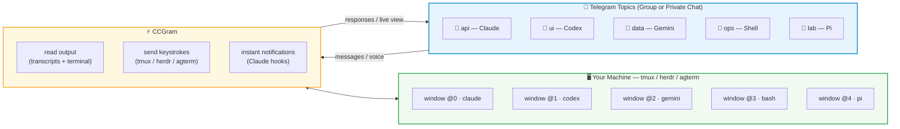

# CCGram — Control AI Coding Agents from Telegram

[](https://github.com/alexei-led/ccgram/actions/workflows/ci.yml)
[](https://pypi.org/project/ccgram/)
[](LICENSE)

**Control AI coding agents from your phone.** Walk away mid-session. Keep monitoring and responding from Telegram—without losing terminal access.

## Why CCGram?

AI coding agents run in your terminal. Other Telegram bots wrap agent SDKs into isolated API sessions you can't resume in your terminal. **CCGram is different.** It sits on top of your terminal multiplexer ([tmux](https://github.com/tmux/tmux), [herdr](https://github.com/ogulcancelik/herdr), or [agterm](https://github.com/umputun/agterm)), not any agent SDK. Your agent process stays exactly where it is—your session is the source of truth.

This means:

- **Desktop to phone, mid-conversation** — walk away and keep monitoring from Telegram
- **Phone back to desktop, anytime** — attach to your terminal and you're back with full scrollback
- **Multiple sessions in parallel** — each Telegram topic maps to a separate tmux window, guarded Herdr agent session, or agterm agent pane

---

## How It Works



Each Telegram topic maps to one tmux window. With Herdr, it maps instead to one guarded agent session: `agent.list` is the sole identity source and CCGram persists only an opaque `herdr-session-v1-…` target, never a tab, pane, or terminal ID. Every Herdr agent topic is provider-prefixed and pane-qualified as `<Provider> ▸ <workspace> ▸ <tab> ▸ <pane>`, so Pi, Claude, Codex, and Gemini topics are easy to find while their labels remain stable when siblings join or leave the tab. Every action reads a fresh `agent.list` record and fails closed for missing, malformed, sessionless, or legacy bindings. Duplicate canonical targets are quarantined while unrelated sessions remain operational. Legacy locator bindings require explicit rebind and are never inferred from names. A session can still change after that guard and before Herdr dispatches, so delivery is not atomic and may be indeterminate after this post-guard race. With agterm, the primary topic retains the session UUID; split peers get separate foreground-guarded targets.

---

## What You Can Do

- **Bind agents to topics** — one agent per group or private-chat topic; create via directory browser
- **Auto-detect providers** — Supports Claude Code, Codex, Gemini, Pi, and Shell simultaneously
- **Monitor live** — Terminal screenshots on demand or auto-refresh every 5 seconds
- **Send commands** — Slash commands, voice messages (transcribed via Whisper), or raw shell input
- **Run multiple agents in parallel** — each topic independent; run different agents at once
- **Recover gracefully** — Resume, continue, or start fresh if a session crashes
- **Send workspace files** — Share files to Telegram via `/send` (glob, path, or substring search)
- **Action toolbar** — Provider-specific buttons for common actions (Screenshot, Mode, Esc, Enter, etc.)
- **Direct choices** — Answer supported numbered and yes/no agent prompts with one tap

## Provider Switching

Topic titles retain their status icon and show a short provider prefix: `Pi · task`, `Claude · task`, or `Term · workspace`. A confirmed automatic switch produces one silent notice; startup, repeated polling, and short-lived intermediate providers do not. Manual changes use the `/agent` reply instead of a second notice.

`/agent` shows the topic name, selected provider, and **Auto** or **Manual** mode. A manual choice is accepted only when it matches the live foreground process; it cannot launch, stop, or redirect an agent. **Auto** follows detection again. Manual selection filters out hooks from other providers. A switch reconciles the existing session-map entry against the live destination: matching entries are retained, mismatches removed, and later matching hooks are admitted while pinned. **Auto** rechecks and cleans the entry before releasing the pin. Manual mode excludes queued transcript replies from other providers, but keeps tail replies across `/new` or `/clear` within the selected provider; an already in-flight send may finish. An exited agent keeps its recovery flow rather than silently turning ordinary chat into shell commands.

## Delivery and Sync Safety

CCGram losslessly combines only eligible consecutive transcript text deliveries for the same chat, topic, window, role, and source session. It preserves each item's formatting and keeps tool updates, media, status updates, and other boundaries separate. The status bubble shows queue progress; at a severe backlog (100 pending items or an oldest item aged 5 minutes), its inline **Jump to live** action requires confirmation and posts a skipped-range notice. The raw provider transcript is never deleted. Delivery is at-least-once, so a Telegram failure or restart before acknowledgement can repeat a transcript message rather than silently losing it.

Topics and their history are deleted as soon as CCGram confirms that the terminal session has closed. Set `CCGRAM_AUTODELETE_DEAD_TOPICS=false` to keep a dead session's topic and its binding instead: the recovery banner still answers the next message there, and a later restart can re-link the topic to a re-keyed session. Failed deletions survive restarts and are retried automatically. `/sync` immediately cleans up locally known stale and retired topics; active or rebound topics are protected. It cannot discover topics whose IDs CCGram no longer knows. See the [Sync cleanup guide](docs/guides.md#sync-and-retired-topic-cleanup) for retries and Telegram admin permissions.

Topics remain protected while their sessions are being created, including slow startup and recovery flows. Creation ownership is saved before remote operations; after a restart, CCGram checks the recorded target before binding or deleting its topic. An unavailable backend or an unresolved creation outcome never counts as a closed session.

---

## Quick Start

**Install:**

```bash
uv tool install ccgram          # recommended
# or: pipx install ccgram | brew install alexei-led/tap/ccgram
```

**Telegram setup:**

1. Create a bot via [@BotFather](https://t.me/BotFather) — [full instructions](docs/guides.md#getting-started)
2. Choose one topic setup:
   - **Private chat:** Enable Topics for the bot in BotFather. Topic 1 is the control topic.
   - **Group:** Add the bot to a Topics-enabled group and promote it to Admin.
3. Create `~/.ccgram/.env`:

```ini
TELEGRAM_BOT_TOKEN=your_bot_token_here
ALLOWED_USERS=your_telegram_user_id
# Group setup only:
CCGRAM_GROUP_ID=your_telegram_group_id
```

Get your user ID from [@userinfobot](https://t.me/userinfobot). For a group, get its ID via [@RawDataBot](https://t.me/RawDataBot) and prefix the Peer ID with `-100`.

**Run:**

```bash
ccgram
```

Open the configured group or private bot chat. Create a topic and send a message. The directory browser appears. Pick a project directory and an agent (Claude, Codex, Gemini, Pi, or Shell).

**Prerequisites:** Python 3.14+, [tmux](https://github.com/tmux/tmux), [herdr](https://github.com/ogulcancelik/herdr), or [agterm](https://github.com/umputun/agterm), and one agent CLI. CCGram does not modify agent SDKs.

### Herdr setup

CCGram supports Herdr protocols **14–22** and uses the public socket API for operations, so a newer CLI can coexist with an older running server. Set `HERDR_SOCKET_PATH` for an explicit endpoint; otherwise `herdr status --json` discovers it. Future protocol numbers are attempted with a warning, extra response fields are tolerated, and required session identities remain strictly validated. Telegram rate limiting uses a protected PTB adapter seam and is therefore tested against and constrained to `python-telegram-bot>=22.8,<22.9`. Install Herdr's integration before launching an agent that needs a native session identity:

```bash
herdr integration install pi
herdr integration install antigravity-cli
```

Restart an already-running agent after installation. Antigravity receives a native Herdr session identity after its first prompt creates a conversation.

Start new agents, or restart already-running agents, after installing the integration so they publish their `agent_session` identity. Then set `CCGRAM_MULTIPLEXER=herdr` and run `ccgram hook --install` as usual.

### agterm setup

agterm is macOS-native. Install [agterm](https://github.com/umputun/agterm), then use **Help > Install Command Line Tool** to put `agtermctl` on `PATH`. Start agterm and confirm that `agtermctl` can reach its control socket. Set `AGTERM_SOCKET` only when the default socket is not the one to use.

Set `CCGRAM_MULTIPLEXER=agterm`. CCGram adopts sessions from the `ccgram` workspace by default; set `CCGRAM_AGTERM_WORKSPACES` to a comma-separated list of workspace names, or `*` for all workspaces. Run `ccgram doctor` to verify the CLI and control socket.

Primary and split agents get separate topics, including hidden splits. Split reads and input validate the peer's foreground command before addressing the right pane; a closed, promoted, or changed peer is refused rather than redirected to the primary. Split topics cannot close or rename the shared session. The guard is not atomic with input, and restarting an identical command reuses the target. Avoid rearranging panes during a Telegram send. Hooks require a unique live provider/session match; ambiguous same-provider panes without explicit CLI session IDs are not bound.

## Platform Support

CCGram supports Linux, macOS, and WSL2. Native Windows is not supported. The agterm backend is macOS-native.

On Windows, install and run CCGram inside WSL2. Install `tmux` or `herdr` and the agent CLI inside the WSL distribution; use agterm only on macOS.

Native Windows does not provide the Unix file locking, signal handling, and terminal multiplexer features that CCGram requires.

---

## Documentation

- **[Guides](docs/guides.md)** — CLI reference, configuration, delivery/backlog safety, `/sync`, voice transcription, multi-instance setup, session recovery, testing
- **[Providers](docs/providers.md)** — Claude Code, Codex, Gemini, Pi, Shell; transcript delivery, session modes, LLM config, custom commands, git worktrees
- **[Architecture](docs/architecture.md)** — delivery queue, transcript watermark, and provider/three-backend multiplexer design

---

## Optional Features

**Web Dashboard** — Live terminal (xterm.js), transcript search, multi-pane grid in Telegram. Disabled by default. [Enable here.](docs/guides.md#mini-app-dashboard-optional)

---

## Development

```bash
git clone https://github.com/alexei-led/ccgram.git && cd ccgram
uv sync --extra dev
make check         # lint, format, typecheck, test
make test-e2e      # end-to-end tests (requires agent CLIs; see docs/guides.md#e2e-tests)
```

---

## License

[MIT](LICENSE)
